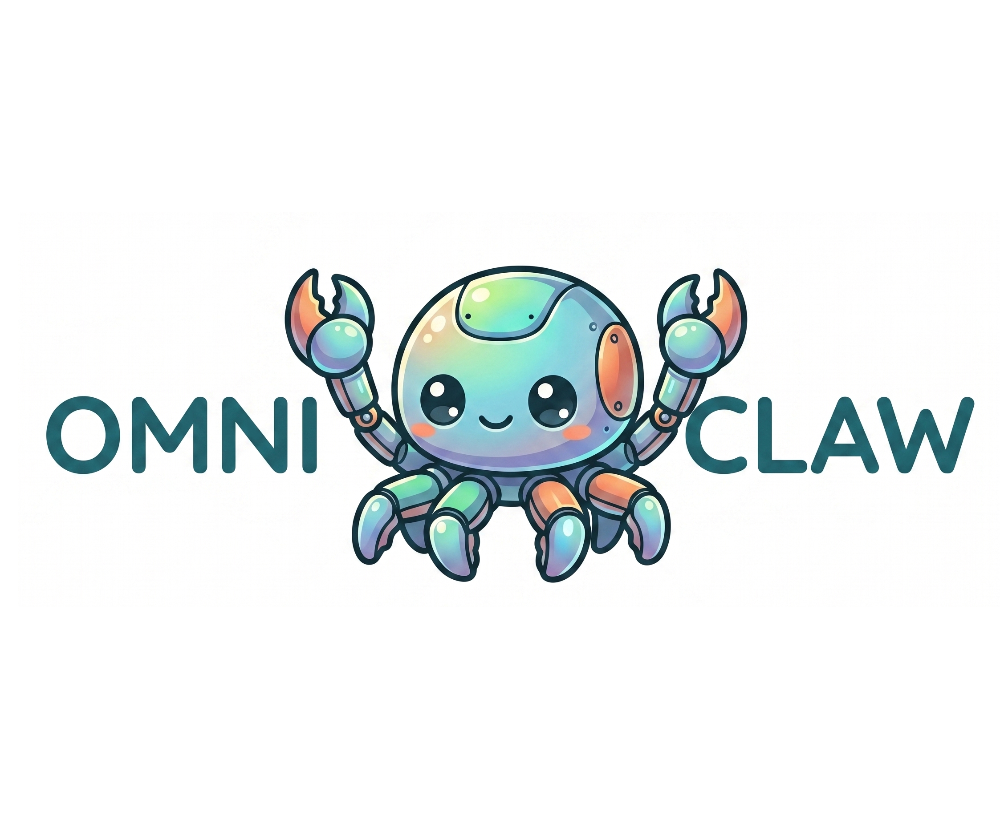

<p align="center">
  
</p>

<p align="center">
  <strong>Omniclaw — Yichen's Personal Academic + Market Intelligence Copilot</strong>
</p>

<p align="center">
  A fork of <a href="https://github.com/qwibitai/nanoclaw">NanoClaw</a> customized into a personal AI copilot that tracks academics, monitors markets, reads email, manages calendar, and drafts actions — running inside isolated Linux containers. Triggered from Discord.
</p>

---

## What This Is

Omniclaw is a personal copilot, not a general-purpose assistant. It combines:

- **Academic tracking** — Canvas and Coursera deadlines from Google Calendar, study help, quizzing from course notes
- **Market intelligence** — portfolio tracking, AI/tech news, Kalshi and Polymarket monitoring, news↔portfolio cross-reference
- **Concrete actions** — draft Gmail emails, create Google Calendar events, write Google Docs, manage Google Tasks
- **GitHub activity tracking** — commits, PRs, stale branches across personal repos
- **Hyperlocal awareness** — real-time CUMTD bus departures (Champaign-Urbana) and OpenWeatherMap forecasts

The agent proactively messages you at 8 AM with a full morning briefing, nudges you at 6 PM about upcoming deadlines, writes a weekly review Friday mornings, and flags cross-domain intelligence in real time (e.g. AI news impacting a held stock).

## Upstream Credit

Omniclaw is built on **[qwibitai/nanoclaw](https://github.com/qwibitai/nanoclaw)**, an AI assistant framework that runs Claude agents securely in Linux containers. All base infrastructure — channel system, container isolation, scheduled tasks, IPC, message queueing — comes from upstream. This fork adds personal skills, MCP integrations, and Discord-primary configuration.

## Skills (`container/skills/`)

Each skill is a folder containing a `SKILL.md` that the agent loads at runtime and activates based on its description field.

| Skill                 | Purpose                                                                     |
| --------------------- | --------------------------------------------------------------------------- |
| `academic/`           | Canvas and Coursera deadlines, study help, quizzing on course notes         |
| `market-intel/`       | Portfolio tracking (`portfolio.md`), AI news, news↔holdings cross-reference |
| `actions/`            | Gmail drafts, Google Calendar events, Google Docs, Google Tasks management  |
| `project-manager/`    | GitHub repo activity, PRs, commits, stale branch warnings                   |
| `prediction-markets/` | Kalshi and Polymarket daily scrape, movers,`market-log.md`                  |
| `cumtd-bus/`          | Real-time Champaign-Urbana bus departures via CUMTD developer API           |
| `weather/`            | Current and forecast weather via OpenWeatherMap                             |

Upstream container skills (`agent-browser`, `capabilities`, `slack-formatting`, `status`) are preserved.

## MCP Integrations

Three MCP servers provide tools to the agent. Configuration lives in `.mcp.json` at the project root (for VS Code Claude Code) and is injected into each group's workspace at container spawn time (for runtime agents).

| MCP                         | Transport                                 | Purpose                                                    |
| --------------------------- | ----------------------------------------- | ---------------------------------------------------------- |
| **Google Workspace**        | streamable-http (host proxy on port 8001) | Gmail, Drive, Calendar, Tasks — 37 tools                   |
| **GitHub**                  | stdio (inside container)                  | Repo, issue, PR, commit access — 25 tools                  |
| **computeedge (Baadal AI)** | sse                                       | Cloud deployment to Hetzner and other providers — 12 tools |

### Google Workspace

Runs as a persistent streamable-http server on the host via [`workspace-mcp`](https://github.com/taylorwilsdon/google_workspace_mcp) on port 8001. Container agents connect via `host.docker.internal:8001/mcp`. OAuth tokens persist in `~/.google_workspace_mcp/credentials`. Managed by `~/Library/LaunchAgents/com.nanoclaw.google-workspace-mcp.plist` on macOS.

### GitHub

Uses [`@modelcontextprotocol/server-github`](https://github.com/modelcontextprotocol/servers/tree/main/src/github) as a stdio server. The personal access token is passed from the host environment into the container via `-e GITHUB_PAT=...` in `src/container-runner.ts`, then substituted into the container's `.mcp.json` at Claude Code load time. The PAT never touches disk inside the container.

### Baadal AI (computeedge)

Cloud deployment tooling. Exposes `analyze_repo`, `compare_providers`, `generate_configs`, `deploy`, and friends. Used to deploy this fork to Hetzner.

## Required Environment Variables

Export these in `~/.zprofile` (for login shells) and propagate via `launchctl setenv` (macOS GUI apps):

```bash
# Google Workspace OAuth client (app identity, not personal tokens)
export GOOGLE_OAUTH_CLIENT_ID=<client-id>.apps.googleusercontent.com
export GOOGLE_OAUTH_CLIENT_SECRET=<client-secret>
export OAUTHLIB_INSECURE_TRANSPORT=1

# GitHub PAT (scopes: repo, read:org, read:user)
export GITHUB_PAT=github_pat_<token>

# CUMTD (free, developer.cumtd.com)
export CUMTD_API_KEY=<key>

# OpenWeatherMap (free tier, openweathermap.org)
export OPENWEATHER_API_KEY=<key>

# Baadal AI
export BAADAL_TOKEN=ce_<key>
```

After editing `.zprofile`, run `launchctl setenv KEY value` for each key so they propagate to running GUI apps, then **fully quit and relaunch** VS Code so Claude Code picks up the new env.

## Groups and Persistent Files

Primary group is **`discord_main/`** (Discord channel with elevated privileges). Its `CLAUDE.md` is kept lean and defers detailed behavior to the skills.

Persistent state in `groups/discord_main/`:

| File                  | Purpose                                                |
| --------------------- | ------------------------------------------------------ |
| `portfolio.md`        | Source of truth for current holdings, updated via chat |
| `market-log.md`       | Append-only prediction market snapshots                |
| `weekly-review.md`    | Friday summaries                                       |
| `cumtd-stops.md`      | Saved bus stop IDs                                     |
| `weather-location.md` | Default city (`Champaign, IL, US`)                     |

## Scheduled Tasks

Created via `mcp__nanoclaw__schedule_task` from inside Discord on first run:

| Name                      | Cron         | Skills invoked                                                               |
| ------------------------- | ------------ | ---------------------------------------------------------------------------- |
| Morning briefing          | `0 8 * * *`  | `academic` + `market-intel` + `prediction-markets` + `cumtd-bus` + `weather` |
| Evening nudge             | `0 18 * * *` | `academic`                                                                   |
| Weekly review             | `0 9 * * 5`  | all                                                                          |
| Prediction markets scrape | `30 7 * * *` | `prediction-markets`                                                         |

## On-Demand Commands

Sent to `@Andy` in Discord:

```
@Andy portfolio
@Andy news
@Andy what should I work on
@Andy I'm overwhelmed
@Andy quiz me on CS 477 formal methods
@Andy when should I leave for class
@Andy update my portfolio: 10 NVDA @ 142, 5 MSFT @ 410
```

## Architecture

Unchanged from upstream NanoClaw — single Node.js process, per-group containers, filesystem isolation.

```
Discord → SQLite → Poll loop → Container (Claude Agent SDK + skills + MCPs) → Response
```

Key files:

- `src/index.ts` — orchestrator
- `src/container-runner.ts` — spawns agent containers, writes `.mcp.json`, injects env vars
- `src/task-scheduler.ts` — scheduled task execution
- `container/Dockerfile` — agent container image (Node 22-slim + Chromium + Claude Code)
- `container/skills/*/SKILL.md` — container skills
- `groups/discord_main/CLAUDE.md` — persona and skill references

## Local Development

```bash
npm install
npm run build
launchctl kickstart -k gui/$(id -u)/com.nanoclaw
```

Rebuild the container after Dockerfile changes:

```bash
./container/build.sh
```

Note: the builder caches aggressively. If `COPY` steps look stale, prune the builder volume and rebuild.

## Deployment to Hetzner via Baadal AI

Deployment uses the `computeedge` MCP from Baadal AI:

1. `analyze_repo(repo_path="https://github.com/GeneralCorn/Omniclaw")` — detect stack and services
2. `estimate_resources` — CPU / RAM / storage sizing
3. `compare_providers` — price comparison, Hetzner default
4. `set_credentials(provider="hetzner", token=...)` — store the Hetzner API token once
5. `generate_configs` — Dockerfile, docker-compose, nginx
6. `deploy(provider_token=..., repo_path="https://github.com/GeneralCorn/Omniclaw")` — spin up server and deploy

All required environment variables must be set on the VPS as docker-compose `environment:` entries.

## Security Notes

- Secrets never touch disk inside containers. The only exception is `GITHUB_PAT`, passed via `-e` flag at container spawn time and held only in container memory
- Host `.env` is shadowed inside main-group containers by a `/dev/null` mount
- OAuth tokens for Google Workspace live only on the host
- Discord bot token lives only on the host

## Credits

- Base system: [qwibitai/nanoclaw](https://github.com/qwibitai/nanoclaw)
- Google Workspace MCP: [taylorwilsdon/google_workspace_mcp](https://github.com/taylorwilsdon/google_workspace_mcp)
- GitHub MCP: [modelcontextprotocol/servers](https://github.com/modelcontextprotocol/servers)
- Baadal AI computeedge MCP: [mcp.baadalai.com](https://mcp.baadalai.com)

## License

MIT (inherited from upstream NanoClaw)
